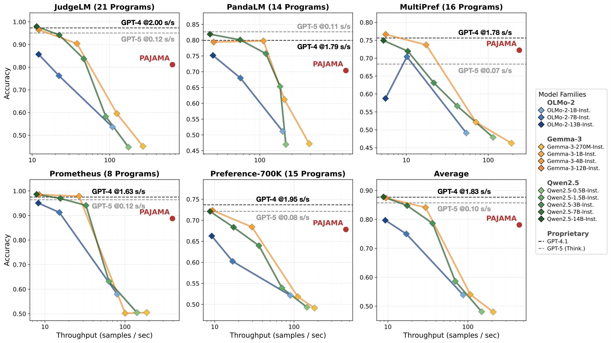

# Codifying the Judge: Scalable Evaluation via Program Distillation

LLM-as-a-judge is everywhere but can suffer from *high cost, significant latency, and opaque decisions*---limitations that undermine its scalability and reliability. We address these with a simple, efficient alternative: program distillation!

We propose **PAJAMA**, a framework for scalable, cost-effective evaluation. Instead of calling a LLM judge for every sample, PAJAMA distills evaluation criteria into lightweight Python programs and aggregates their predictions using weak supervision to produce final verdicts.

## Main Results

Programmatic judges enable scalable, high-throughput, low-cost, and transparent evaluation.



## Quickstart

**Install dependencies:**

```bash
pip install -r requirements.txt
```

**Generate judge programs:**
* using JudgeLM-100K dataset as an example.
```bash
export ANTHROPIC_API_KEY="sk-ant-..."
python synthesized_programmatic_judges/generate_programs.py --dataset judgelm
```

**Run the evaluation pipeline:**

```bash
python pajama_workflow/run.py --dataset judgelm
```

**Train the reward model (Optional)**---prepared training data is available in `reward_model_distillation`; or run `reward_model_distillation/converting_data.py` to generate your own:

```bash
python reward_model_distillation/reward_model_training.py \
  --model_name Qwen/Qwen2.5-3B-Instruct \
  --train_set_path rm_data_judgelm \
  --output_path ./models/qwen_rm_judgelm
```

**Launch the interactive demo (an evaluation studio!):**

```bash
cd demo && streamlit run app.py
```

## Dataset

Our benchmark datasets are available on Hugging Face:
[https://huggingface.co/datasets/sprocket-lab/PAJAMA](https://huggingface.co/datasets/sprocket-lab/PAJAMA)

## How PAJAMA Works

**1. Program Generation** — Generates 80 judge programs (10 evaluation rubrics × 8 variants each). Each program takes a query and a response, then returns a float score using only built-in Python (no ML libraries), making them fast and deterministic.

**2. Program Execution** — Each program scores both responses in a pairwise comparison, producing a label matrix over the dataset.

**3. Program Output Modeling** — Per-program thresholds are tuned on a validation set, low-accuracy programs are filtered, and weak supervision's `LabelModel` learns per-program accuracy weights to produce final preference predictions.

**4. (Optional) Reward Model Training** — The predicted labels are used to fine-tune a Qwen2.5-3B reward model for downstream use.

## Project Structure

```text
synthesized_programmatic_judges/   # Program generation
pajama_workflow/                   # Core program-based evaluation pipeline
reward_model_distillation/         # Reward model training on aggregated labels
llm_judges/                        # LLM-as-judge baseline (using vLLM)
demo/                              # Streamlit UI for interactive exploration
```

## Demo

The Streamlit demo supports two modes:

- **Mock mode** (default): Uses pre-generated programs and cached scores; runs in under a second.
- **Live mode**: Upload a JSONL file, generate programs on-the-fly with Claude, and run the full pipeline interactively.

The demo lets you inspect individual judge programs, edit them, regenerate specific programs via chat, and download the final labeled dataset.

## Citation

If you like this work and are playing these datasets, please cite the original benchmark papers and our PAJAMA!

**Latest version:**

```bibtex
@article{huang2026codifying,
  title={Codifying the Judge: Scalable Evaluation via Program Distillation},
  author={Huang, Tzu-Heng and  Qiu, Shengqi and Sala, Frederic},
  journal={},
  year={2026}
}
```

**Preliminary version** (appeared in ICML 2025 Workshop: Programmatic Representations for Agent Learning):

```bibtex
@article{huang2025time,
  title={Time to Impeach LLM-as-a-Judge: Programs are the Future of Evaluation},
  author={Huang, Tzu-Heng and Vishwakarma, Harit and Sala, Frederic},
  journal={arXiv preprint arXiv:2506.10403},
  year={2025}
}
```
